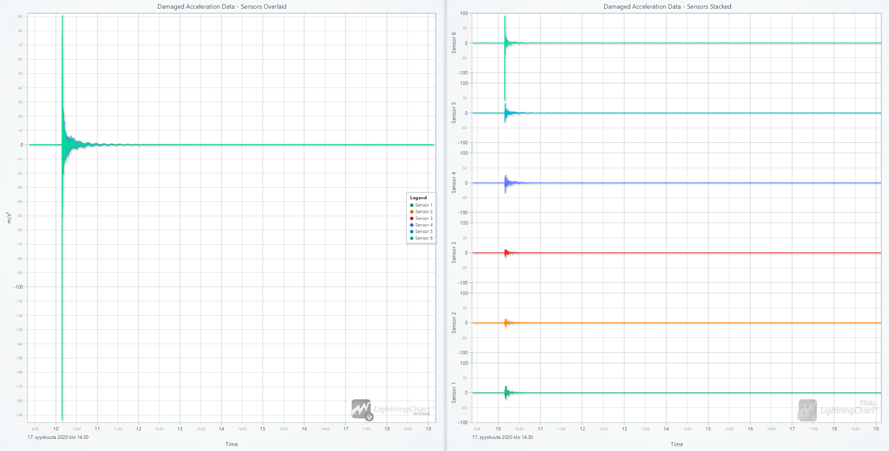

# Structural Health Monitoring System for Civil Infrastructure in Python

## Introduction

### What is Structural Health Monitoring (SHM)?

Structural Health Monitoring (SHM) refers to the process of implementing a damage detection strategy for structures. SHM involves using sensors and data acquisition systems to collect information about a structure's condition overtime. This data is then analyzed to identify any changes or anomalies that might indicate damage or degradation.

### How Does Civil Engineering Use Structural Health Monitoring Systems?

In civil engineering, SHM systems monitor various types of infrastructure, includingbridges, buildings, dams, and tunnels. These systems use a range of sensors,such as accelerometers, strain gauges, and temperature sensors, to measure parameters like vibrations, deformations, and environmental conditions. The collected data helps engineers assess structural integrity and make informed decisions about maintenance and repairs.

### Why is it Important to Monitor Structural Health?

Monitoring structural health is vital for several reasons:

1. **Safety**: Ensures the safety of occupants and users by detecting potential structural failures.
2. **Cost-Effective Maintenance**: Helps in planning maintenance activities efficiently, reducing costs associated with unexpected repairs.
3. **Longevity**: Prolongs the lifespan of structures by addressing issues before they become severe.
4. **Regulatory Compliance**: Assists in complying with safety regulations and standards.

### What are Structural Sensors and Their Role in SHM?

Structural sensors are devices used to measure physical quantities related to the structural integrity of a building or infrastructure. These sensors play a crucial role in SHM by providing real-time data on parameters like strain, temperature, and acceleration. The information gathered by these sensors is essential for the integrated matrix analysis of structures, allowing for a comprehensive assessment of building integrity.

## Understanding Shear Buildings

A shear building refers to a structure primarily supported by shear walls. Shear walls are vertical elements that resist lateral forces, such as those caused by wind or earthquakes, through shear and flexural strength. These walls are essential in maintaining a building's stability and integrity, especially in high-rise constructions. Shear buildings are designed to manage these forces efficiently, ensuring that the structure can withstand dynamic loads without significant deformation.

The dataset used in this project employs a six-storey shear building model. Each building floor has an accelerometer (sensor) for six accelerometers. These sensors measure the dynamic floor responses, which are crucial for assessing the structural integrity of the building.

## LightningChart Python

### Overview of LightningChart Python Usability for This Specific Project

LightningChart Python is a powerful tool for visualizing data, particularly in structural integrity analysis projects. Its advanced charting capabilities are ideal for displaying real-time data from SHM systems, providing clear and insightful
visual representations of structural health metrics. LightningChart Python is a powerful tool for visualizing data, particularly in projects involving structural integrity analysis. Its advanced charting capabilities make it ideal for displaying real time data from SHM systems, providing clear and insightful visual representations of structural health metrics.

## Setting Up Python Environment

### Installing Python and Necessary Libraries

To set up the Python environment for this project, you need to install Python and the necessary libraries. This includes installing LightningChart Python and Pandas.

```bash
pip install lightningchart pandas
```

### Overview of Libraries Used

- **[LightningChart Python](https://lightningchart.com/python-charts/docs/ "Documentation")**: Provides advanced charting functionalities for visualizing structural health data.
- **[Pandas](https://pandas.pydata.org/docs/ "Documentation")**: Essential for data manipulation and analysis.

### Setting Up Your Development Environment

Set up your development environment by creating a new project directory and installing the required libraries. Ensure that LightningChart Python is properly licensed and configured.

## Loading and Processing Data

### Overview of the Data

The data used in this project comes from the dataset "Acceleration time history data for experimental shear building model" provided by Kumar Anjney and Koushik Roy. The dataset contains dynamic floor responses from a six-storey three-dimensional miniature model (scale 1:20) of a shear building. The experimental setup is located at the Structural Health Monitoring Lab, Block VI, Department of Civil and Environmental Engineering, Indian Institute of Technology (IIT), Patna, Bihar, India.

The dataset includes both "Damaged" and "Undamaged" folders, each containing around 20 Excel files with data. However, upon investigating these files, it was observed that the data across them is quite similar. This suggests that the same type of test was likely conducted multiple times. Due to the lack of additional context from the dataset's source, we chose to visualize only the first file for this project to represent the dataset.

Image of the model building used in the experiment:


### How to Load Data Files

Use Pandas to read the data files into a DataFrame for easy manipulation and analysis.

```python
import pandas as pd

# Define the path to the Excel file containing the data
dataPath = 'DmgData17thSept/SB17SEPDMR1.xlsx'

# Read the Excel file into a DataFrame using pandas
dmgData = pd.read_excel(dataPath)

# Display the first five rows of the DataFrame to get a quick look at the data
dmgData.head()
```

### Basic Data Processing Techniques

Clean and preprocess the data to ensure it is ready for analysis.

```python
# Drop rows with any missing values from the DataFrame
dmgDataCleaned = dmgData.dropna()

# Rename the columns of the DataFrame for better readability
dmgDataCleaned.columns = ['Time', 'Acceleration1', 'Acceleration2', 'Acceleration3', 'Acceleration4', 'Acceleration5', 'Acceleration6']

# Convert all values in the DataFrame to numeric type (if they are not already)
dmgDataCleaned.apply(pd.to_numeric)

# Display the first ten rows of the cleaned DataFrame to inspect the data
dmgDataCleaned.head(10)
```

## Visualizing Data with LightningChart

### Creating Waveform Graphs

Use LightningChart Python to create waveform graphs of the acceleration data.

```python
import lightningchart as lc

# Create a dashboard object with a specified number of columns and rows, and a light theme
dashboard = lc.Dashboard(columns=2, rows=1, theme=lc.Themes.Light)

# Opens and initializes dashboard before adding the data
dashboard.open(live=True)

# Extract the time and acceleration data from the DataFrame
time = dmgDataCleaned['Time'].tolist()
time = [x * 1000 for x in time]  # Convert time to milliseconds

# Extract acceleration data for each sensor and convert to lists
acceleration1 = dmgDataCleaned['Acceleration1'].tolist()
acceleration2 = dmgDataCleaned['Acceleration2'].tolist()
acceleration3 = dmgDataCleaned['Acceleration3'].tolist()
acceleration4 = dmgDataCleaned['Acceleration4'].tolist()
acceleration5 = dmgDataCleaned['Acceleration5'].tolist()
acceleration6 = dmgDataCleaned['Acceleration6'].tolist()

# Grouped chart (overlay of all sensors' data)
chart1 = dashboard.ChartXY(column_index=0, row_index=0)
chart1.set_title('Damaged Acceleration Data - Sensors Overlaid')
chart1.get_default_x_axis().set_title('Time').set_tick_strategy('DateTime', 1600342203000)
chart1.get_default_y_axis().set_title('m/s²')

# Add line series for each sensor to the grouped chart
series_1 = chart1.add_line_series().append_samples(x_values=time, y_values=acceleration1)
series_1.set_name('Sensor 1')
series_2 = chart1.add_line_series().append_samples(x_values=time, y_values=acceleration2)
series_2.set_name('Sensor 2')
series_3 = chart1.add_line_series().append_samples(x_values=time, y_values=acceleration3)
series_3.set_name('Sensor 3')
series_4 = chart1.add_line_series().append_samples(x_values=time, y_values=acceleration4)
series_4.set_name('Sensor 4')
series_5 = chart1.add_line_series().append_samples(x_values=time, y_values=acceleration5)
series_5.set_name('Sensor 5')
series_6 = chart1.add_line_series().append_samples(x_values=time, y_values=acceleration6)
series_6.set_name('Sensor 6')

# Set the line thickness for each series in the grouped chart
for series in [series_1, series_2, series_3, series_4, series_5, series_6]:
    series.set_line_thickness(2)

# Add a legend to the grouped chart
chart1.add_legend(data=chart1)

# Stacked Chart (each sensor's data on a separate Y-axis)
chart2 = dashboard.ChartXY(column_index=1, row_index=0)
chart2.set_title('Damaged Acceleration Data - Sensors Stacked')
chart2.get_default_x_axis().set_title('Time').set_tick_strategy('DateTime', 1600342203000)

# Remove the default Y-axis since we will add custom Y-axes for each series
chart2.get_default_y_axis().dispose()

# Function to add a series to the chart with a stacked Y-axis
def add_series_with_stacked_y_axis(chart, stack_index, x_values, y_values, title):
    # Add a new Y-axis with the specified stack index
    axis_y = chart.add_y_axis(stack_index=stack_index)
  
    # Set margins for the Y-axis (no margins for the first and last axes)
    axis_y.set_margins(15 if stack_index > 0 else 0, 15 if stack_index < 5 else 0)
  
    # Set the title for the Y-axis
    axis_y.set_title(title=title)
  
    # Set the interval for the Y-axis and stop after the specified range
    axis_y.set_interval(-100, 100, stop_axis_after=True)
  
    # Add a line series to the chart using the newly created Y-axis
    series = chart.add_line_series(y_axis=axis_y, data_pattern='ProgressiveX')
  
    # Append the data to the series
    series.append_samples(x_values=x_values, y_values=y_values)
  
    # Set the name and line thickness for the series
    series.set_name(title)
    series.set_line_thickness(2)

# Add each sensor's data to the stacked chart with its own stacked Y-axis
add_series_with_stacked_y_axis(chart2, 0, time, acceleration1, 'Sensor 1')
add_series_with_stacked_y_axis(chart2, 1, time, acceleration2, 'Sensor 2')
add_series_with_stacked_y_axis(chart2, 2, time, acceleration3, 'Sensor 3')
add_series_with_stacked_y_axis(chart2, 3, time, acceleration4, 'Sensor 4')
add_series_with_stacked_y_axis(chart2, 4, time, acceleration5, 'Sensor 5')
add_series_with_stacked_y_axis(chart2, 5, time, acceleration6, 'Sensor 6')
```

This code creates a dashboard with two charts: one where the data from all six sensors is overlaid, and another where each sensor's data is displayed on a separate Y-axis. This visualization provides a comprehensive view of the acceleration data, making it easier to analyze and compare the responses from each sensor.

### Customizing Visualizations, If Necessary

Adjust the chart properties to customize the visualizations as per your requirements.

### Streaming and Updating Data in Real-Time

LightningChart Python allows for real-time data streaming and updates, which is essential for monitoring ongoing structural health.

## Dashboard Visualization



## Reflections on Sensor Data

Upon analyzing the dataset, a notable observation was made regarding Sensor 6. It appears that Sensor 6 has measured higher values compared to the other sensors, which mostly have almost the same values. This discrepancy might be due to several factors:

1. **Impact or Force Near Sensor 6** : The higher values might be due to an impact or force occurring right at or near Sensor 6.
2. **Sensor Sensitivity** : It could also be because Sensor 6 is more sensitive compared to the other sensors and may need recalibration.
3. **Structural Flexibility** : The acceleration measured at the top floor of the building (where Sensor 6 is located) might be higher due to the increased flexibility of the structure at higher levels.

It's important to note that this dataset is from an experimental environment. In a real-world scenario, such a reading would require further monitoring or even an on-site visit to ensure the accuracy of the data and the integrity of the sensor.

## Conclusion

### Recap of the Python Data Processing Workflow

In this project, we set up a Python environment, loaded and processed structural health monitoring data, and visualized it using LightningChart Python. The process involved reading data files, cleaning and preprocessing the data, and creating insightful visualizations.

### Benefits of Using LightningChart Python for Visualizing Data for This Specific Project

LightningChart Python offers advanced charting capabilities that are essential for visualizing complex SHM data. Its ability to handle real-time data and provide clear, customizable visualizations makes it an invaluable tool for structural integrity analysis.

By following this workflow, engineers and researchers can effectively monitor the health of civil infrastructure, ensuring safety and longevity through timely interventions.

## Sources

* https://data.mendeley.com/datasets/snmz587nvb/1
* https://data.mendeley.com/datasets/snmz587nvb/2
* https://www.bigrentz.com/blog/shear-wall
